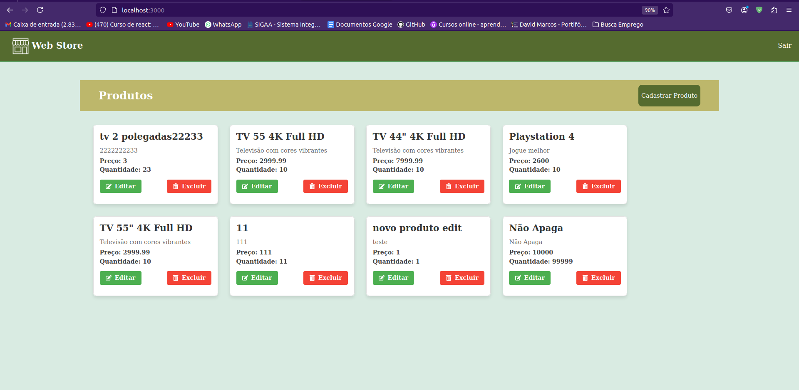

## 
<div style="display: flex; align-items: center;">
  <span style="margin-left: 10px; font-size: 24px; font-weight: bold;">Web Store</span>
</div>
<hr>

Esta aplicação consiste em um sistema de gestão de produtos para uma loja web.




## Tecnologias Utilizadas no Projeto:

### Front-end:

- React.js
- HTML
- CSS
- TypeScript

### Dependências:

- É necessário ter o Node.js instalado no seu computador. Para instalar, acesse: [Instalar Node.js](https://nodejs.org/en/download/package-manager).

### Executando o Projeto:

1. Abra a pasta raiz do projeto, crie o arquivo `.env` e adicione no arquivo a seguinte linha:

    ```bash
    REACT_APP_API_URL = "https://interview.t-alpha.com.br"
    ```

2. Instale as dependências executando o seguinte comando:

    ```bash
    npm install
    ```

3. Inicie a aplicação executando o seguinte comando:

    ```bash
    npm start
    ```

4. Para acessar a aplicação, abra o navegador e entre no link:

    ```bash
    http://localhost:3000/
    ```
